# blood-bank-management
Blood Bank Management System using JAVA

### This Project is built using :-

#### 1. JAVA
#### 2. JAVAFX
#### 3. Scene Builder
#### 4. JDBC API
#### 5. MySQL Database with mysql-connector library
#### 6. JFOENIX for material Design
#### 7. javamail - mailing library
#### 8. SARXOS for web cam library

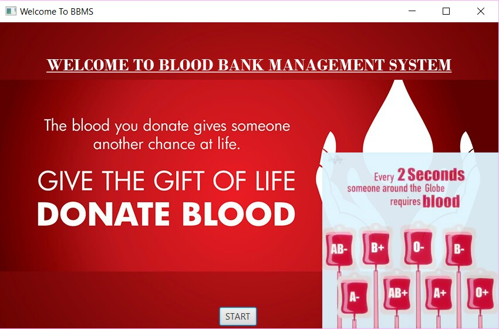
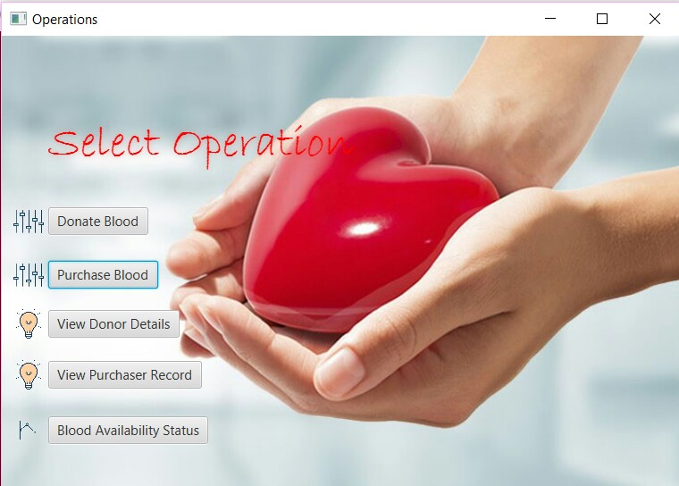
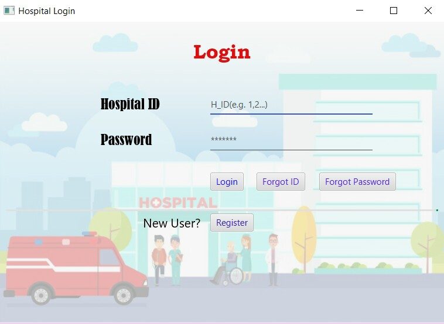
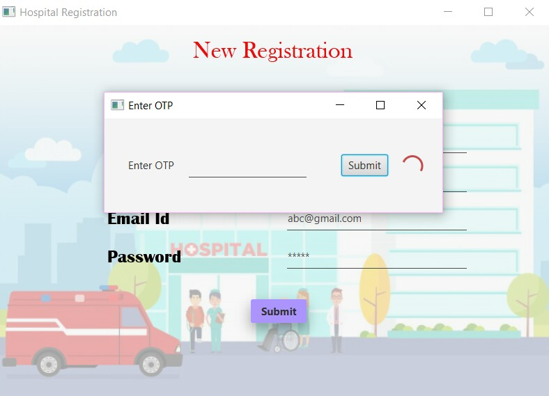
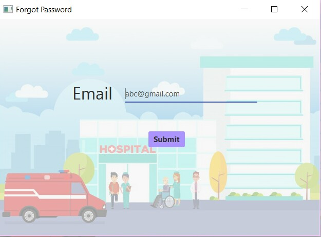
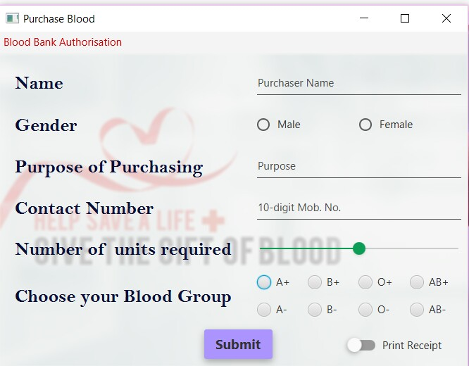
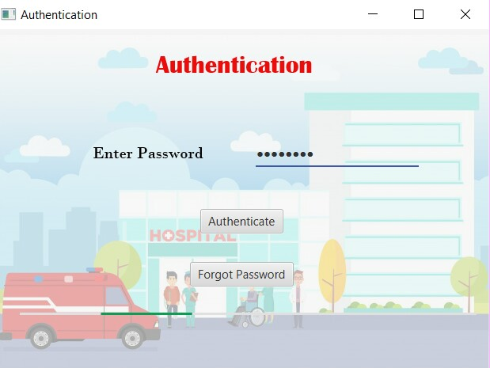
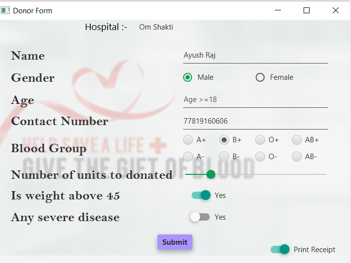
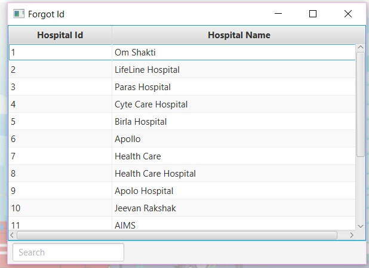
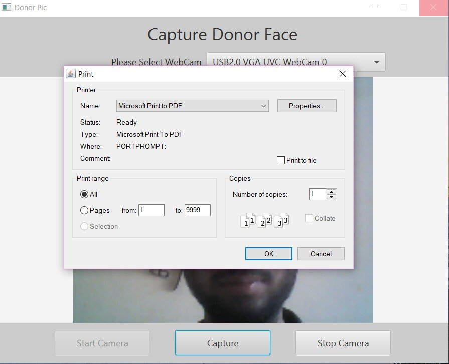
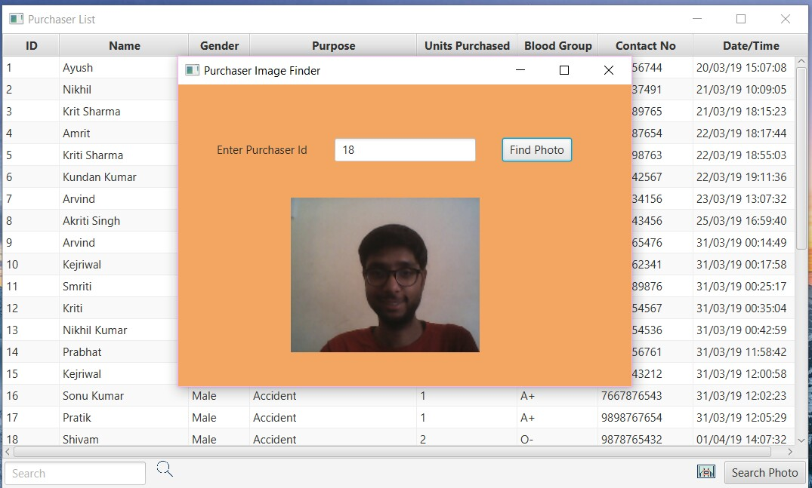
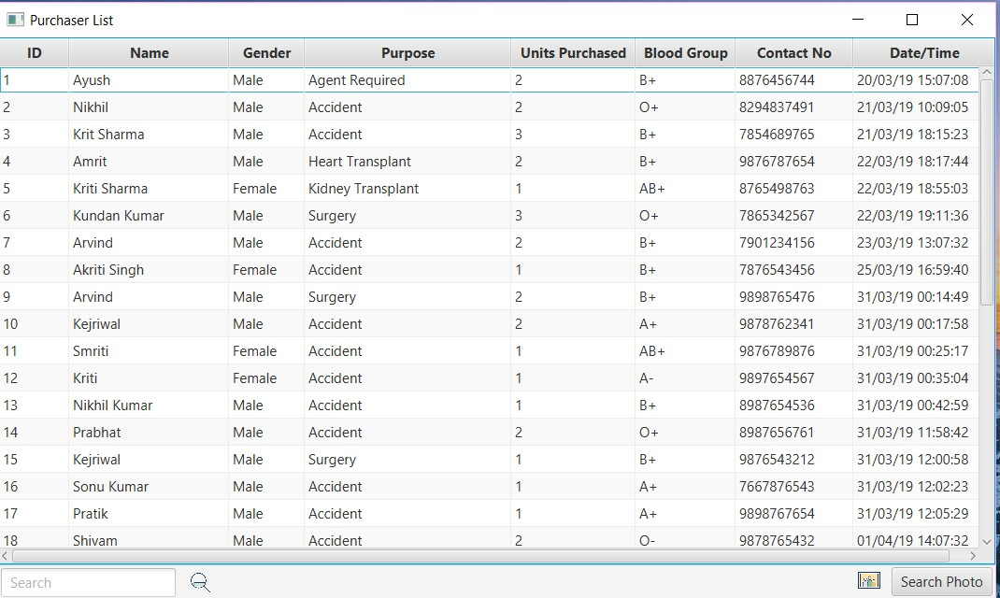
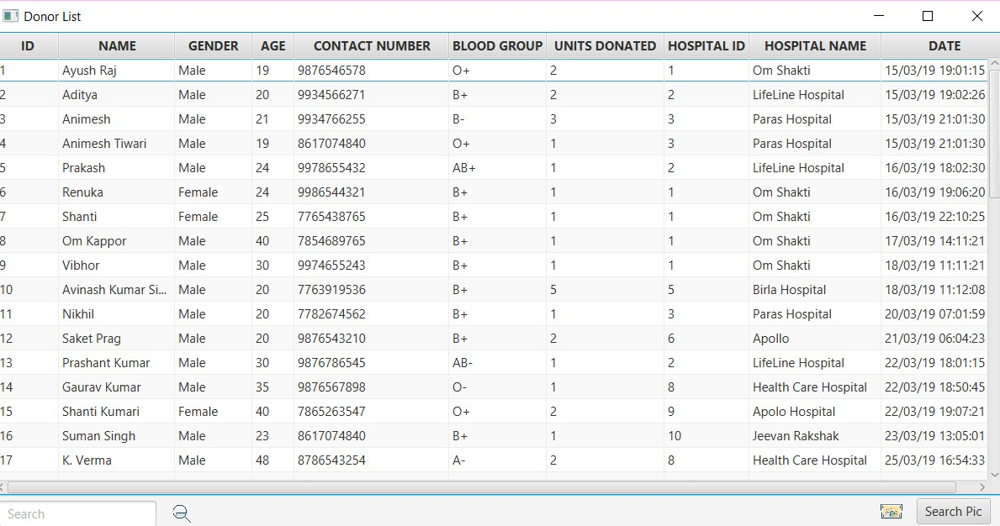
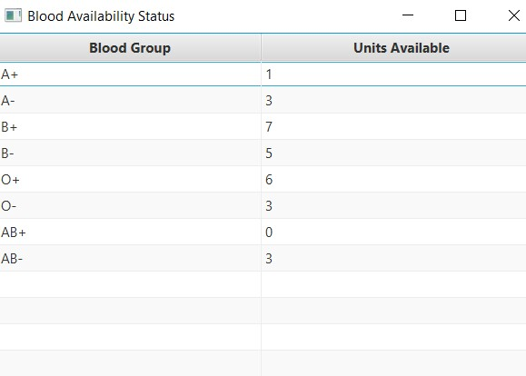
